# git-practice

## 1. Настройка Git

#### 1. `git config --global user.name "Ваше имя"` – установить имя пользователя

#### 2. `git config --global user.email "ваша@почта.com"` – установить email

#### 3.`git config --list` – посмотреть текущие настройки

## 2. Создание и клонирование репозитория

#### 1. `git init` – создать новый локальный репозиторий

#### 2.`git clone <URL-репозитория>` – склонировать удалённый репозиторий

## 3. Работа с изменениями

#### 1. `git status` – проверить состояние файлов (изменённые, новые, удалённые)

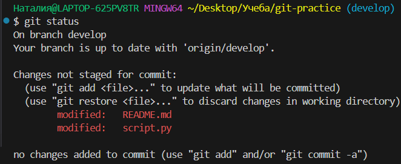

#### 2.`git add <файл>` – добавить файл в индекс (staging area)

#### 3. `git add .` – добавить все изменённые файлы

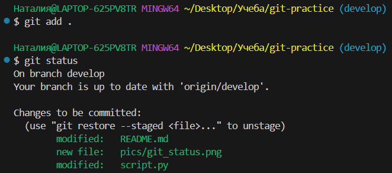

##### 4. `git commit -m "Сообщение коммита"` – зафиксировать изменения с комментарием

#### 5. `git commit --amend` – изменить последний коммит (например, добавить файлы или исправить сообщение)

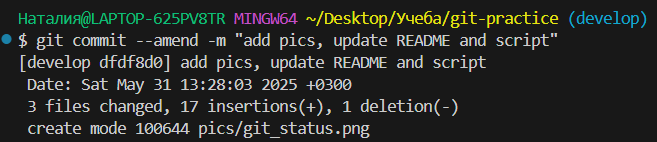

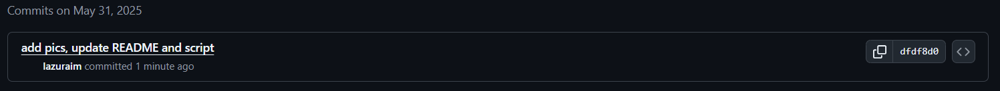

## 4. Просмотр истории и изменений

#### 1. `git log` – показать историю коммитов

#### 2. `git log --oneline` – компактный вывод истории

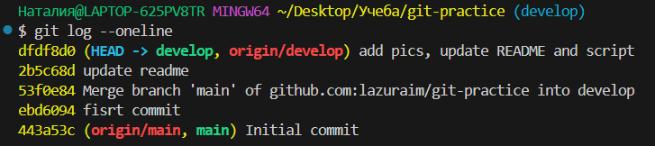

#### 3. `git diff` – показать изменения в файлах (ещё не добавленных в индекс)

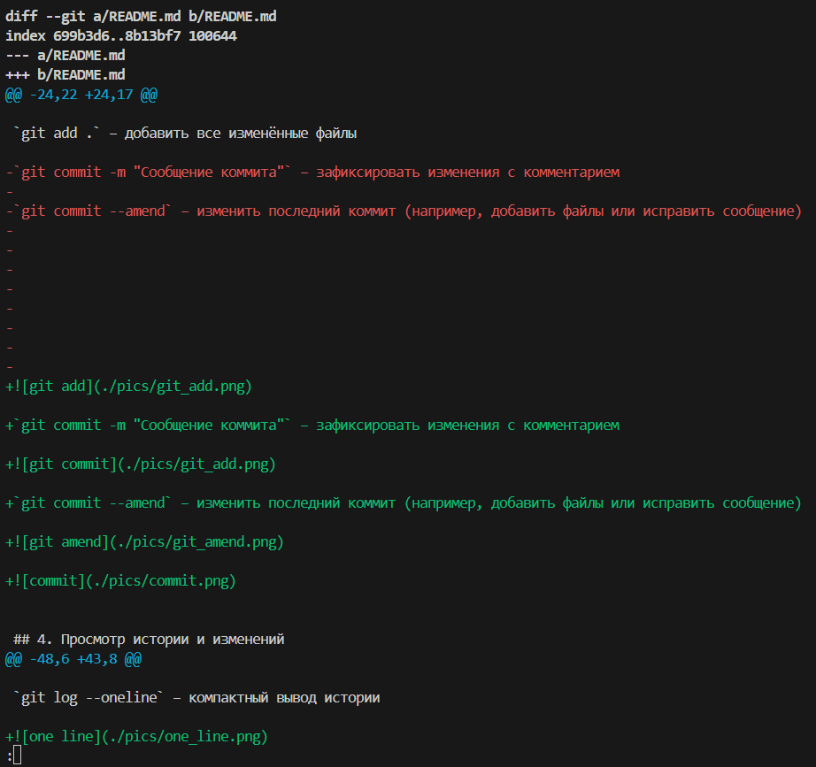

##### 4. `git diff --staged` – показать изменения в индексированных файлах (после выполнения `git add`)

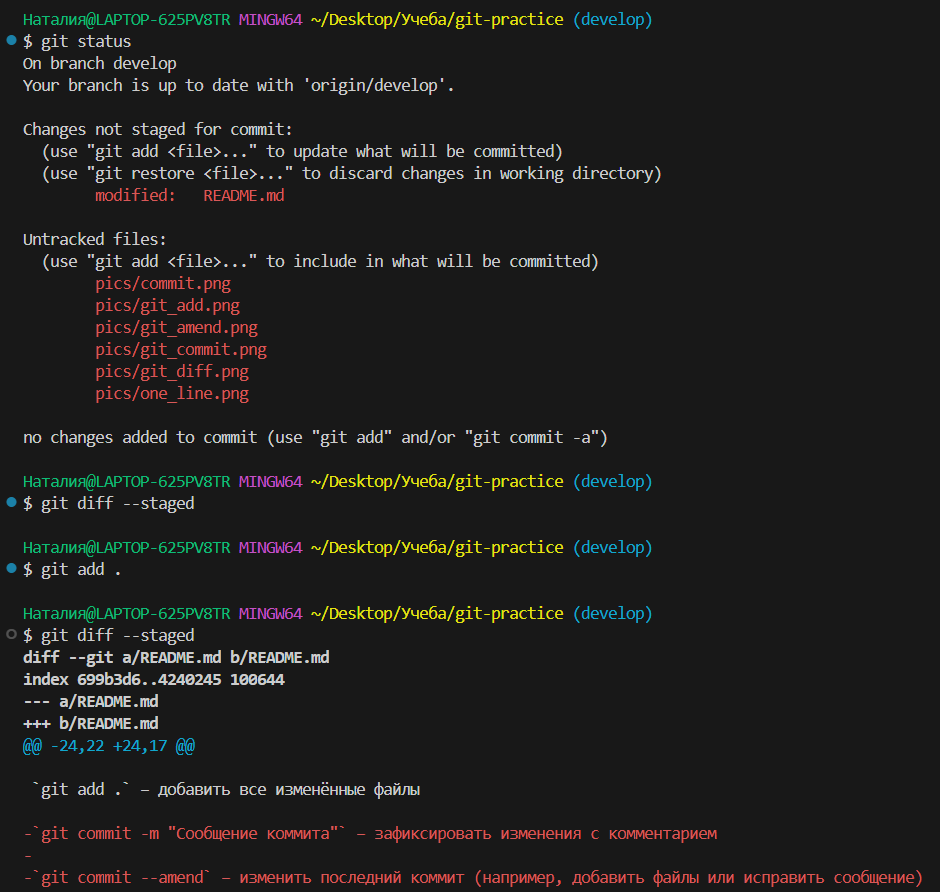

`:wq`- чтобы выйти 

## 5. Ветки (branches)

#### 1. `git branch` – список веток

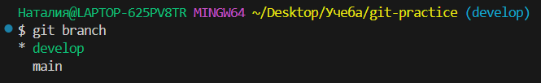

#### 2. `git branch <имя-ветки>` – создать новую ветку

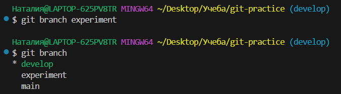

#### 3. `git checkout <имя-ветки>` – переключиться на ветку

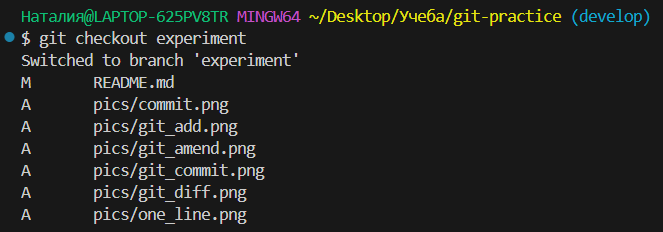

#### 4. `git switch <имя-ветки>` – альтернатива checkout (Git 2.23+)

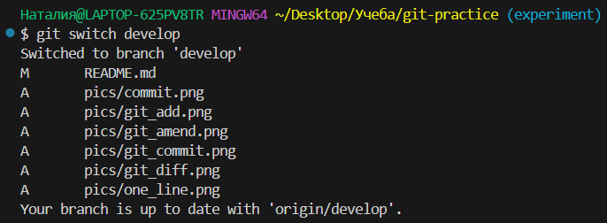

#### 5. `git checkout -b <имя-ветки>` – создать и переключиться на новую ветку

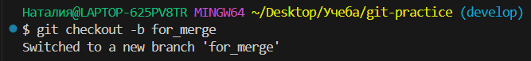

Создаем новый файл в ветке for_merge, чтобы позже слить эту ветку с develop, добавив новый файл и закоммиченные изменения в README

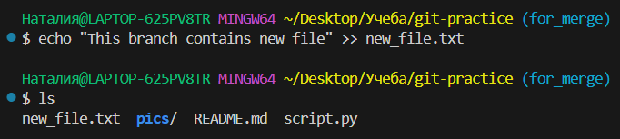

Комиттим изменения и пушим их в удаленный репозиторий

#### 6. `git push origin <ветка>` – отправить изменения в удалённый репозиторий

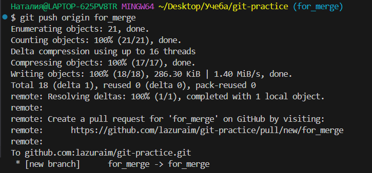

Переключаемся на develop, чтобы влить туда изменения с ветки for_merge

#### 7. `git merge <имя-ветки>` – влить изменения из указанной ветки в текущую

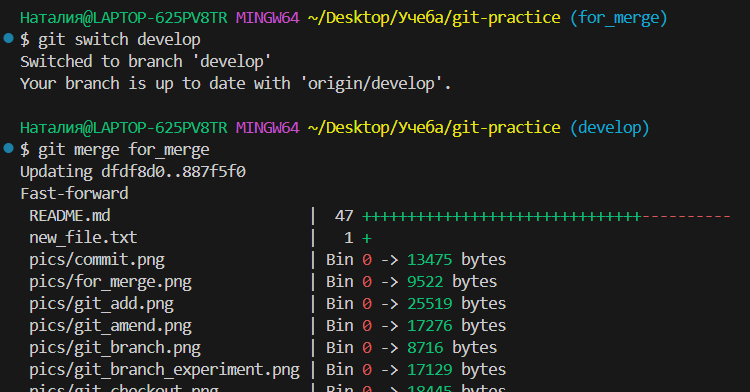

#### 8. `git branch -d <имя-ветки>` – удалить ветку (если изменения уже влиты)

#### 9. `git branch -D <имя-ветки>` – принудительно удалить ветку

## 6. Работа с удалённым репозиторием (remote)

#### 1. `git remote add origin <URL-репозитория>` – добавить удалённый репозиторий

#### 2. `git remote -v` – показать список удалённых репозиториев

#### 3. `git push -u origin <ветка>` – отправить и установить связь ветки с удалённой (при первом push)

#### 4. `git pull` – получить изменения из удалённого репозитория и автоматически слить

#### 5. `git fetch` – получить изменения из удалённого репозитория, но не сливать

## 7. Отмена изменений

#### 1. `git restore <файл>` – отменить изменения в файле (ещё не добавленном в индекс)

#### 2. `git restore --staged <файл>` – убрать файл из индекса (но сохранить изменения)

#### 3. `git reset --hard` – отменить все локальные изменения (осторожно!)

#### 4. `git revert <хэш-коммита>` – отменить конкретный коммит, создав новый

## 8. Временное сохранение изменений (stash)

#### 1. `git stash` – временно сохранить изменения без коммита

#### 2. `git stash pop` – восстановить последние сохранённые изменения

#### 3. `git stash list` – список сохранённых stash

#### 4. `git stash apply stash@{n}` – применить конкретный stash

## 9. Теги (tags)

#### 1. `git tag` – список тегов

#### 2. `git tag <имя-тега>` – создать лёгкий тег

#### 3. `git tag -a <имя-тега> -m "Описание"` – создать аннотированный тег

#### 4. `git push origin --tags` – отправить теги в удалённый репозиторий